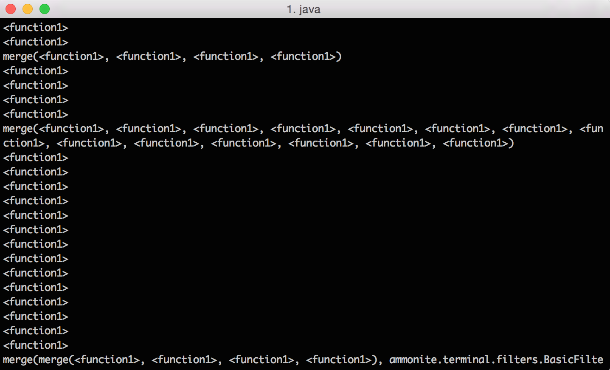
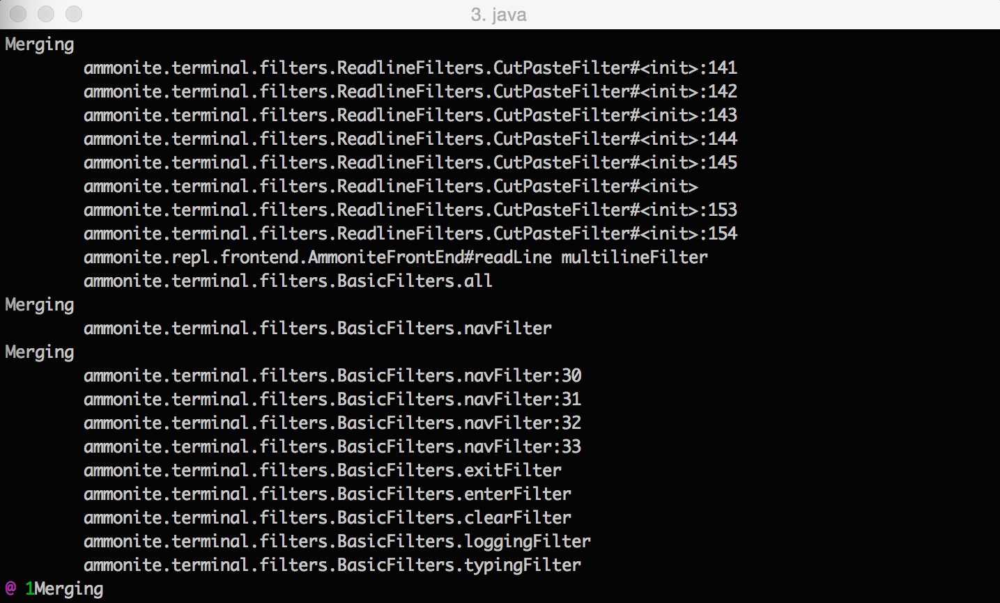

SourceCode [](https://travis-ci.org/lihaoyi/sourcecode) [](https://gitter.im/lihaoyi/sourcecode?utm_source=badge&utm_medium=badge&utm_campaign=pr-badge&utm_content=badge) [](https://maven-badges.herokuapp.com/maven-central/com.lihaoyi/sourcecode_2.11)
==========

```scala
"com.lihaoyi" %% "sourcecode" % "0.1.5" // Scala-JVM
"com.lihaoyi" %%% "sourcecode" % "0.1.5" // Scala.js / Scala Native
```

`sourcecode` is a small Scala library for that provides common "source code"
context to your program at runtime, similar to Python's `__name__`, C++'s
`__LINE__` or Ruby's `__FILE__`. For example, you can ask for the file-name
and line number of the current file, either through the `()` syntax or via an
implicit:

```scala
val file = sourcecode.File()
assert(file.endsWith("/sourcecode/shared/src/test/scala/sourcecode/Tests.scala"))

val line = implicitly[sourcecode.Line]
assert(line == 16)
```

This might not be something you want to use for "business logic", but is very
helpful for things like [debugging](#debug-prints), [logging](#logging) or 
providing automatic diagnostics for [DSLs](#embedding-domain-specific-languages). 
This information is also available via an `implicit`, letting you write functions
that automatically pull it in. 

Using SourceCode on code dealing with lots of anonymous functions or anonymous
classes can easily turn what you see in your debug printouts from this:



To this:



By capturing source information you can use to give your objects and function 
meaningful names that tell you where they were defined, automatically without 
needing you to manually assign a string-ID to every anonymous function or 
anonymous class you define all over your code bas. 

Table of Contents
=================

- [Overview](#overview)
- [Examples](#examples)
- [Use Cases](#use-cases)
    - [Logging](#logging)
    - [Enums](#enums)
    - [Debug Prints](#debug-prints)
    - [Embedding Domain-Specific Languages](#embedding-domain-specific-languages)
- [Version History](#version-history)

Overview
========
The kinds of compilation-time data that `sourcecode` provides are:

- `sourcecode.File`: full path of the current file where the call occurs
- `sourcecode.Line`: current line number
- `sourcecode.Name`: the name of the nearest enclosing definition: `val`,
  `class`, whatever.
- `sourcecode.FullName`: the name of the nearest enclosing definition: `val`,
  `class`, whatever, prefixed by the names of all enclosing `class`s, `trait`s,
  `object`s or `package`s. Note that this does *not* include other enclosing
  `def`s, `val`s, `var`s or `lazy val`s`
- `sourcecode.Enclosing`: the name of the nearest enclosing definition: `val`,
  `class`, whatever, prefixed by the names of all enclosing `class`s, `trait`s,
  `object`s or `package`s, `def`s, `val`s, `var`s or `lazy val`s`
- `sourcecode.Text[T]`: when you want to take a value of type `T`, but also 
  want to get the "source text" of that particular value. Note that if 
  you have multiple statements in a `{}` block, `sourcecode.Text` will only 
  capture the source code for the last expression that gets returned. This
  implicit is slightly experimental; be sure to report any bugs you find!
- `sourcecode.Args`: the arguments that where provided to the nearest enclosing 
  method
- `sourcecode.Name.Machine`, `sourcecode.FullName.Machine` and 
  `sourcecode.Enclosing.Machine` which are similar to `sourcecode.Name`,
  `sourcecode.FullName` and `sourcecode.Enclosing` except they do not filter
  out synthetic method names; e.g. if you want to see the `<init>` names or
  `<local foo>` names as part of the path, use these instead.

All these are available both via `()` and as implicits, e.g. `sourcecode.File`
can be summoned via `sourcecode.File()` or `implicitly[sourcecode.File].value`.
This also means you can define functions that pull in this information
automatically:

```scala
def foo(arg: String)(implicit file: sourcecode.File) = {
  ... do something with arg ...
  ... do something with file.value ...
}

foo("hello") // the implicit sourcecode.File is filled in automatically
```

`sourcecode` does not rely on runtime reflection or stack inspection, and
is done at compile-time using macros. This means that it is both orders of
magnitude faster than e.g. getting file-name and line-numbers using stack
inspection, and also works on Scala.js where reflection and stack inspection
can't be used.

Examples
========

Here are a few examples of `sourcecode`'s core functions being used in a 
variety of contexts. Hopefully they will give you an idea of how the various
implicits behave:

```scala
package sourcecode

object Implicits {
  def implicitRun() = {
    val name = implicitly[sourcecode.Name]
    assert(name.value == "name")

    val fullName = implicitly[sourcecode.FullName]
    assert(fullName.value == "sourcecode.Implicits.fullName")

    val enclosing = implicitly[sourcecode.Enclosing]
    assert(enclosing.value == "sourcecode.Implicits.implicitRun enclosing")

    val pkg = implicitly[sourcecode.Pkg]
    assert(pkg.value == "sourcecode")

    val file = implicitly[sourcecode.File]
    assert(file.value.endsWith("/sourcecode/shared/src/test/scala/sourcecode/Implicits.scala"))

    val line = implicitly[sourcecode.Line]
    assert(line.value == 20)

    lazy val myLazy = {
      trait Bar{
        val name = implicitly[sourcecode.Name]
        assert(name.value == "name")

        val fullName = implicitly[sourcecode.FullName]
        assert(fullName.value == "sourcecode.Implicits.Bar.fullName")

        val file = implicitly[sourcecode.File]
        assert(file.value.endsWith("/sourcecode/shared/src/test/scala/sourcecode/Implicits.scala"))

        val line = implicitly[sourcecode.Line]
        assert(line.value == 34)

        val enclosing = implicitly[sourcecode.Enclosing]
        assert(enclosing.value == "sourcecode.Implicits.implicitRun myLazy$lzy Bar#enclosing")
      }
      val b = new Bar{}
    }
    myLazy
  }
}
```

Note that in "normal" usage you would not directly call `implicitly` to summon 
up `sourcecode` values; rather, you would add implicit parameters of these 
types to your functions. That would make these values automatically available
to your functions without needing to manually keep passing them in. Apart from
summoning them via implicits, you can also use the `apply` method on each type
to pull them in using the `()` syntax:

```scala
package sourcecode

object Apply {
  def applyRun() = {
    val name = sourcecode.Name()
    assert(name == "name")

    val fullName = sourcecode.FullName()
    assert(fullName == "sourcecode.Apply.fullName")

    val enclosing = sourcecode.Enclosing()
    assert(enclosing == "sourcecode.Apply.applyRun enclosing")

    val pkg = sourcecode.Pkg()
    assert(pkg == "sourcecode")

    val file = sourcecode.File()
    assert(file.endsWith("/sourcecode/shared/src/test/scala/sourcecode/Apply.scala"))

    val line = sourcecode.Line()
    assert(line == 20)

    lazy val myLazy = {
      trait Bar{
        val name = sourcecode.Name()
        assert(name == "name")

        val fullName = sourcecode.FullName()
        assert(fullName == "sourcecode.Apply.Bar.fullName")

        val file = sourcecode.File()
        assert(file.endsWith("/sourcecode/shared/src/test/scala/sourcecode/Apply.scala"))

        val line = sourcecode.Line()
        assert(line == 34)

        val enclosing = sourcecode.Enclosing()
        assert(enclosing == "sourcecode.Apply.applyRun myLazy$lzy Bar#enclosing")
      }
      val b = new Bar{}
    }
    myLazy
  }
}
```

By default, the various implicits all ignore any synthetic `<init>` or 
`<local Foo>` methods that might be present:

```scala
package sourcecode

object NoSynthetic {
  def run() = {
    class EnumValue(implicit name: sourcecode.Name){
      override def toString = name.value
    }
    object Foo extends EnumValue

    assert(Foo.toString == "Foo")

    object Bar{
      assert(sourcecode.Name() == "Bar")
      assert(sourcecode.FullName() == "sourcecode.NoSynthetic.Bar")
      assert(sourcecode.Enclosing() == "sourcecode.NoSynthetic.run Bar")
    }
    Bar
  }
}
```

If you want these synthetic methods to be shown, use the `.Machine` versions
of each of these instead:

```scala
package sourcecode

object Synthetic {
  def run() = {
    class EnumValue(implicit name: sourcecode.Name.Machine){
      override def toString = name.value
    }
    object Foo extends EnumValue

    assert(Foo.toString == "<init>")

    object Bar{
      assert(sourcecode.Name.Machine() == "<local Bar>", sourcecode.Name())
      assert(sourcecode.FullName.Machine() == "sourcecode.Synthetic.Bar.<local Bar>")
      assert(sourcecode.Enclosing.Machine() == "sourcecode.Synthetic.run Bar.<local Bar>")
    }
    Bar
  }
}
```

Hopefully this has given you a reasonable feel for *what** sourcecode does. You
may still be wondering *why* we would want any of this: what could we possibly 
use these things for? Why would we want to write code that depends on our 
package paths or variable names? The section below will provide use cases that
you will hopefully be able to relate to. 

Use Cases
=========

At first it might seem strange to make use of these source-level details in
your program: shouldn't a program's meaning not change under re-formatting and
re-factoring?

It turns out that there are a number of entirely valid use cases for this sort
of information that is both extremely handy, and also would not be surprising
at all to a developer using your API. Here are a few example use cases:

Logging
-------

You can use `sourcecode.File` and `sourcecode.Line` to define `log` functions
that automatically capture their line number and file-name

```scala
def log(foo: String)(implicit line: sourcecode.Line, file: sourcecode.File) = {
  println(s"${file.value}:${line.value} $foo")
}

log("Foooooo") // sourcecode/shared/src/test/scala/sourcecode/Tests.scala:86 Fooooo
```

This can be handy for letting you see where the log lines are coming from,
without tediously tagging every log statement with a unique prefix.
Furthermore, this happens at compile time, and is thus orders of magnitude
faster than getting this information by generating stack traces, and works
on Scala.js where stack-inspection does not. Lastly, if you want additional 
information such as method names, class names, or packages to be provided to
your logging function, you can easily do so by asking for the `sourcecode.Name`
or `sourcecode.FullName` or `sourcecode.Pkg` implicits.

Enums
-----

You can use `sourcecode.Name` to define an enumeration-value factory function
that automatically assigns names to the enum values based on the name of the
`val` that it is assigned to

```scala
package sourcecode

object EnumExample {
  def run() = {
    case class EnumValue(name: String){
      override def toString = name
    }
    class Enum{
      def value(implicit name: sourcecode.Name) = EnumValue(name.value)
    }
    object MyEnum extends Enum{
      val firstItem = value
      val secondItem = value
    }
    assert(MyEnum.firstItem.toString == "firstItem")
    assert(MyEnum.secondItem.toString == "secondItem")
  }
}
```

This is very handy, and this functionality is used in a number of libraries
such as [FastParse](http://lihaoyi.github.io/fastparse/) and
[Scalatags](http://lihaoyi.github.io/scalatags/#CSSStylesheets) to provide
a boilerplate-free experience while still providing good debuggability
and convenience.

Sometimes you want to make sure that different enum values in differently
named enums (or even an enum of the same name in a different package!) are
given unique names. In that case, you can use `sourcecode.FullName` or
`sourcecode.Enclosing` to capture the full path e.g.
`"com.mypkg.MyEnum.firstItem"` and `"com.mypkg.MyEnum.secondItem"`:
 
```scala
package sourcecode

object EnumFull {
  def run() = {
    case class EnumValue(name: String){
      override def toString = name
    }
    class Enum{
      def value(implicit name: sourcecode.FullName) = EnumValue(name.value)
    }
    object MyEnum extends Enum{
      val firstItem = value
      val secondItem = value
    }
    assert(MyEnum.firstItem.toString == "sourcecode.EnumFull.MyEnum.firstItem")
    assert(MyEnum.secondItem.toString == "sourcecode.EnumFull.MyEnum.secondItem")
  }
}
```
You can also use `sourcecode.Name` in an constructor, in which case it'll be 
picked up during inheritance:

```scala
class EnumValue(implicit name: sourcecode.Name){
  override def toString = name.value
}
object Foo extends EnumValue
println(Foo.toString)
assert(Foo.toString == "Foo")
```

Debug Prints
------------

How many times have you written tedious code like
```scala
object Bar{
  def foo(arg: String) = {
    println("Bar.foo: " + arg)
  }
}
```

Where you have to prefix every print statement with the name of the enclosing
classes, objects or functions to make sure you can find your print output
2-3 minutes later? With `source.Enclosing`, you can get this for free:

```scala
def debug[V](value: sourcecode.Text[V])(implicit enclosing: sourcecode.Enclosing) = {
  println(enclosing.value + " [" + value.source + "]: " + value.value)
}

class Foo(arg: Int){
  debug(arg) // sourcecode.DebugRun.main Foo [arg]: 123
  def bar(param: String) = {
    debug(arg -> param)
  }
}
new Foo(123).bar("lol")  // sourcecode.DebugRun.main Foo#bar [arg -> param]: (123,lol)
```

You can easily vary the amount of verbosity, e.g. by swapping the 
`sourcecode.Enclosing` for a `sourcecode.Name` if you think it's too verbose:

```scala
def debug[V](value: sourcecode.Text[V])(implicit name: sourcecode.Name) = {
  println(name.value + " [" + value.source + "]: " + value.value)
}

class Foo(arg: Int){
  debug(arg) // Foo [arg]: 123
  def bar(param: String) = {
    debug(param -> arg)
  }
}
new Foo(123).bar("lol")  // bar [param]: lol
```

Or leaving it out entirely:

```scala
def debug[V](value: sourcecode.Text[V]) = {
  println("[" + value.source + "]: " + value.value)
}

class Foo(arg: Int){
  debug(arg) // [arg]: 123
  def bar(param: String) = {
    debug(param -> arg)
  }
}
new Foo(123).bar("lol")  // [param]: lol
```

Thus you can easily configure how much information your `debug` helper method
needs, at its definition, without having to hunt all over your codebase for the
various `debug` call-sites you left lying around and manually tweaking the 
verbosity of each one. Furthermore, if you want additional information like
`sourcecode.Line` or `sourcecode.File`, that's all just one implicit away.

The [PPrint](http://www.lihaoyi.com/upickle-pprint/pprint) 
library provides a `pprint.log` method that does exactly this: prints out the
value provided (in this case pretty-printing it with colors and nice formatting
& indentation) together with the enclosing context and line number, so you
can easily distinguish your individual prints later:

```scala
scala> class Foo{
     |   def bar(grid: Seq[Seq[Int]]) = {
     |     // automatically capture and print out source context 
     |     pprint.log(grid, tag="grid") 
     |   }
     | }
defined class Foo

scala> new Foo().bar(Seq(0 until 10, 10 until 20, 20 until 30))
pkg.Foo#bar "grid":12
List(
  Range(0, 1, 2, 3, 4, 5, 6, 7, 8, 9),
  Range(10, 11, 12, 13, 14, 15, 16, 17, 18, 19),
  Range(20, 21, 22, 23, 24, 25, 26, 27, 28, 29)
)
```

`pprint.log` is itself defined as 

```scala
def log[T: PPrint](value: T, tag: String = "")
                  (implicit cfg: Config = Config.Colors.PPrintConfig,
                   path: sourcecode.Enclosing,
                   line: sourcecode.Line) = ...
```

Using `sourcecode.Enclosing` and `sourcecode.Line` to provide the context to
be printed. You can, or course, define your own `log` method in the same way,
customizing it to print or not-print exactly what you want to see via the 
implicits that `sourcecode` provides!

`sourcecode.Args` can be used to access all parameters that where provided 
to a method:

```scala
def debug(implicit name: sourcecode.Name, args: sourcecode.Args): Unit = {
  println(name.value + args.value.map(_.map(a => a.source + "=" + a.value).mkString("(", ", ", ")")).mkString(""))
}

def foo(bar: String, baz: Int)(p: Boolean): Unit = {
  debug
}

foo("baz", 42)(true) // foo(bar=baz, baz=42)(p=true)
```

Embedding Domain-Specific Languages
-----------------------------------

The Scala programming is a popular choice to embed domain-specific languages:
that means that you start with some external language, e.g. this 
[MathProg] example

```scala
param m;
param n;
param l;

set I := 1 .. m;
set J := 1 .. n;
set K := 1 .. l;

param c{J};
param d{K};
param a{I, J};

var x{J} integer, >= 0;
var y{K} >= 0;
```

The linked slides has more detail about what exactly this language does (it
describes mathematical optimization problems). For a variety of reasons, you 
may prefer to write this as part of a Scala program instead: for example you
may want Scala's IDE support, or its ability to define functions that help
reduce boilerplate, or maybe you like the way the compiler provides type errors
when you do the wrong thing.

A first attempt at converting this to Scala may look like this:

```scala
val m = param("m")
val n = param("n")
val l = param("l")

val I = set("I") := 1 to m
val J = set("J") := 1 to m
val K = set("K") := 1 to m

val c = param("c", J)
val d = param("d", K)
val a = param("a", I, J)

val x = xvar("x", J).integer >= 0
val y = xvar("y", K) >= 0
```

There's a bunch of duplication around the names of the `val`s: each `val`
has its name repeated in a string that gets passed to the expression on the
right. This is for the program to use the name of the `val` later: for example
when printing error messages, or the results of the computation, you want to
see which `val`s are involved! Thus you end up duplicating the names over and
over and over.

With sourcecode, you can easily define `param` `set` and `xvar` as taking 
implicit `sourcecode.Name`s, thus eliminating all the boilerplate involved in 
duplicating names:

```scala
val m = param
val n = param
val l = param

val I = set := 1 to m
val J = set := 1 to m
val K = set := 1 to m

val c = param(J)
val d = param(K)
val a = param(I, J)

val x = xvar(J).integer >= 0
val y = xvar(K) >= 0
```

The popular [FastParse](http://www.lihaoyi.com/fastparse/) parser-combinator
library uses sourcecode for exactly this use case

```scala
import fastparse.all._
val A = P( "aa" )
val B = P( "bb" )
val C = P( (A | B).rep(1) )

C.parse("aabb") // Success((), 4)
C.parse("X") // Failure((A | B):1:1 ..."X")
```

As you can see, the names of the rules `A` and `B` are embedded in the error
messages for parse failures. This makes debugging parsers far easier, while 
saving you the effort of duplicating the name of the parser in possibly 
hundreds of rules in a large parser. In this case, it is the `P(...)` function
which takes an implicit `sourcecode.Name` that does this work:

```scala
def P[T](p: => Parser[T])(implicit name: sourcecode.Name): Parser[T] =
    parsers.Combinators.Rule(name.value, () => p)
```

And forwards the name on to the actual `Rule` object, which can make use of it
in its `.toString` method.

Version History
===============

0.1.5
-----
- Upgrade Scala, ScalaJS, Scala Native versions ([a21c11a](https://github.com/lihaoyi/sourcecode/commit/a21c11a2d92351013161cb9a889754bcf7095f86))

0.1.4
-----

- Add Scala Native support [#34](https://github.com/lihaoyi/sourcecode/pull/34)
- Add 2.13.0-M1 support, [#30](https://github.com/lihaoyi/sourcecode/pull/30)
- Add OSGi header to jar manifests, [#32](https://github.com/lihaoyi/sourcecode/pull/32)

0.1.3
-----

- Add scala 2.12.x support, thanks to 
  [Lars Hupel](https://github.com/larsrh)

0.1.2
-----

- Add `sourcecode.Args` implicit, which can be used to capture debugging information
  about the nearest enclosing function call for logging/debugging, thanks to 
  [Benjamin Hagemeister](https://github.com/benhag)

- Attempted fix for [#17](https://github.com/lihaoyi/sourcecode/issues/17) and 
  [#13](https://github.com/lihaoyi/sourcecode/issues/13), thanks to
  [Simeon H.K. Fitch](https://github.com/metasim) 

0.1.1
-----

- Ignore `<local foo>` and `<init>` symbols when determining `sourcecode.Name`, 
  `sourcecode.FullName` or `sourcecode.Enclosing`. If you want these, use the
  `sourcecode.Name.Machine`/`sourcecode.FullName.Machine`/`sourcecode.Enclosing.Machine`
  implicits instead.
   
- Add `sourcecode.Text` implicit to capture source code of an expression

- Add implicit conversions to `sourcecode.*`, so you can pass in a `String`
  to manually satisfy and implicit wanting a `sourcecode.Name` or 
  `sourcecode.FullName` or `sourcecode.File`, an `Int` to satisfy an implicit 
  asking for `sourcecode.Line` 

- `sourcecode.Enclosing` has been simplified to take a single `String` rather
  than the previous `Vector[Chunk]`.
  
- Added the `sourcecode.Pkg` implicit, which provides the current 
  enclosing package without any of the `class`s/`object`s/`def`s/etc.. Can be 
  subtracted from `sourcecode.Enclosing` if you *only* want the 
  `class`s/`object`s/`def`s/etc.

0.1.0
-----

- First release

[MathProg]: http://www.slideshare.net/gerferra/an-embedded-dsl-to-manipulate-mathprog-mixed-integer-programming-models-within-scala
